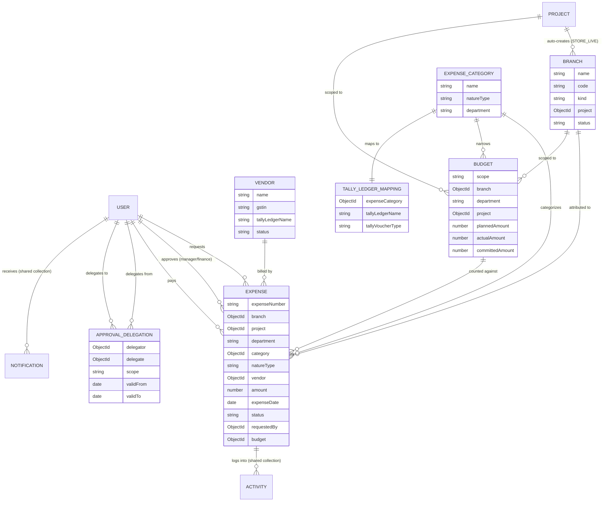
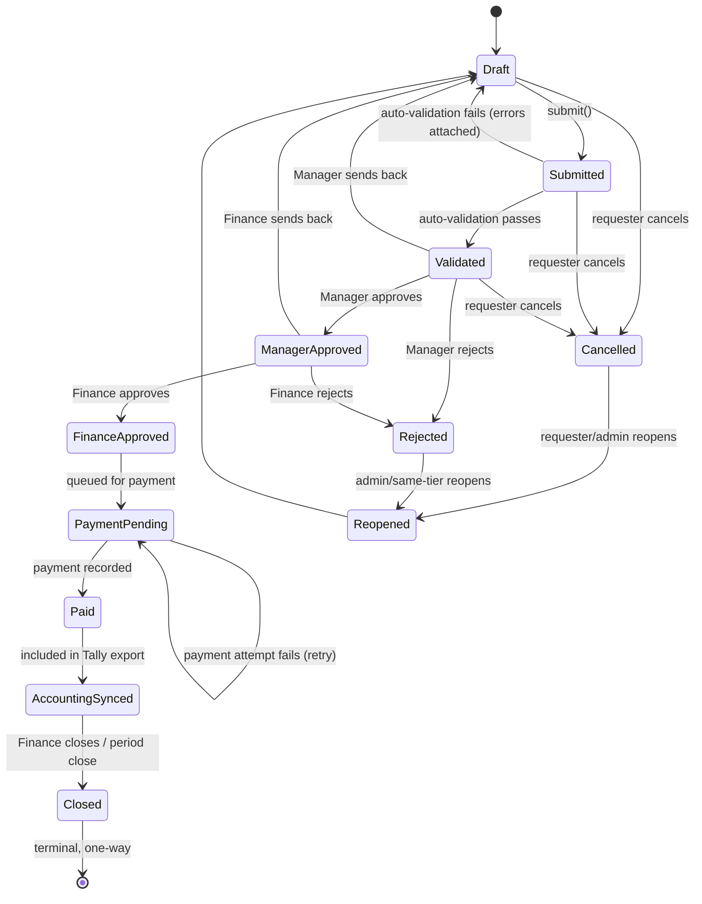
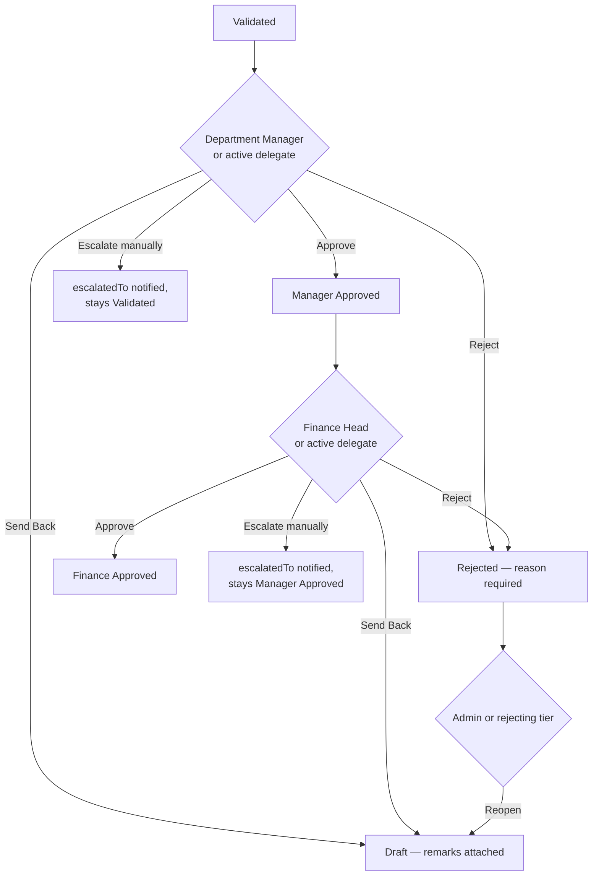
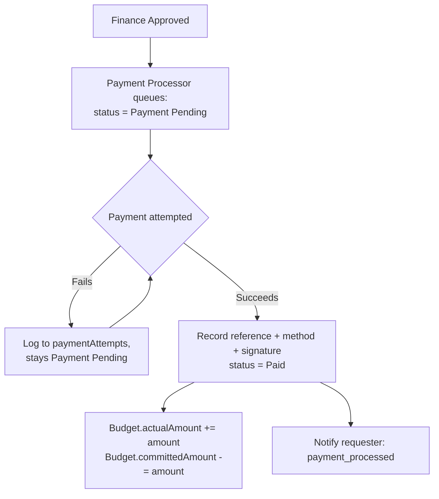

# EMS — Expense Management System — Complete Architecture Blueprint

**Status:** Frozen for review. Nothing in this document is implemented except Step 1 (module integration — routing, sidebar, layout scaffolding, see `client/src/features/expenses/`). No business logic, database schema, or API described here exists in code yet.

**Precedence:** This document supersedes the earlier informal EMS plan (`ems-master-plan` memory / original 5-phase plan) wherever the two disagree — this is the more detailed, later, and authoritative design. The mandated build order (Step 1 Integration → Step 2 Expense Request → Step 3 Department Approval → Step 4 Finance Approval → Step 5 Payment → Step 6 Budget → Step 7 Accounting → Step 8 Reports) still governs sequencing.

**Scope boundary:** EMS is a cross-cutting, always-on ERP module — not a PMS phase. It has its own top-level route family (`/ems/*`), its own backend module family (`server/src/modules/finance/`), and must never affect a Project's `p1..p10` stage completion.

---

## Table of Contents

1. Business Requirements
2. Complete Module Structure
3. Complete Database Design
4. Expense State Machine
5. Budget Architecture
6. Approval Workflow
7. Vendor Module
8. Payment Module
9. Accounting Integration
10. Notifications
11. Activity Logs
12. Audit Trail
13. Permissions
14. REST API Design
15. RTK Query Design
16. Folder Structure
17. Reusable Components
18. Reports
19. Dashboard
20. Risks

Deliverables (diagrams and matrices) are embedded inline in their relevant sections, and cross-referenced from the **Deliverables Index** at the end.

---

## 1. Business Requirements

### Problems EMS solves
- Expense requests today are handled manually (paper/chat/spreadsheet) with no system of record, no enforced approval chain, no budget visibility, and no link to accounting.
- No single place answers "how much have we spent, by branch/department/project/vendor, against what was planned."
- No enforced separation of duties on who can request, approve, and pay — financial control depends on informal trust.
- No accounting integration — Tally entries are a manual, error-prone re-keying exercise.

### Business objectives
- Centralize every company expense from request to payment to accounting entry, in one auditable system.
- Enforce a real approval chain with segregation of duties (a requester can never approve or pay their own request).
- Give Finance real-time budget visibility and proactive alerts before overspend happens, not after.
- Produce Tally-ready accounting exports without manual re-entry.
- Produce reporting cut by branch, department, project, and vendor — the four axes the business actually manages spend by.

### User journey (primary path)
1. An **Employee** (Requester) submits an expense request with supporting documents, choosing a branch, department, category (fixed/variable), and optionally a vendor.
2. The system auto-validates the request (required fields, attachments, budget availability check).
3. The **Department Manager** reviews and approves, sends back for correction, or rejects.
4. The **Finance Head** reviews and gives financial approval, or sends back/rejects.
5. The **Payment Processor** queues it for payment, then marks it paid with a reference number and method.
6. **Finance** batches paid expenses into a Tally XML export; the expense is marked Accounting Synced.
7. At period close, Finance closes the expense — a terminal, non-editable state.
8. Throughout, budget consumption is tracked live; **Finance Head**/**Admin** get alerted as a budget approaches or crosses its threshold.
9. Anyone with the right permission can pull reports by branch, department, project, or vendor at any time.

### Real-world workflow (concrete example)
A store manager at the Bhopal branch needs to pay an electrician ₹8,000 for an emergency repair. They submit an expense under "Branch: Bhopal DB Mall," "Category: Maintenance (Variable)," attach the electrician's invoice photo, and submit. Their Department Manager (Operations) approves same-day. Finance Head approves the next morning. Payment Processor pays via UPI, records the reference number. At week's end, Finance exports the week's paid expenses to Tally as a batch. The Bhopal branch's Operations budget for the month shows ₹8,000 consumed against its planned allocation, visible on the Budget dashboard the moment the Payment Processor marked it paid.

---

## 2. Complete Module Structure

| Module | Purpose | Primary users | Ships in |
|---|---|---|---|
| Dashboard | KPIs, alerts, recent activity, pending approvals, budget summary | Everyone (scoped to role) | Step 8 (assembled last, once every other module has real data) |
| Expense Requests | Create/view/edit expense requests, attachments, draft/submit/cancel | Employees, Managers | Step 2 |
| Categories | Fixed/variable expense category master data | Admin, Finance | Step 2 (alongside Expense Requests) |
| Vendors | Vendor master data, GST, bank details | Admin, Finance | Step 2 (alongside) |
| Branches | Branch master data expenses attribute to | Admin, Finance | Step 2 (alongside) |
| Budgets | Allocation, consumption, alerts, dashboard | Finance Head, Admin | Step 6 |
| Approval Workflow | Department + Finance approval queues, delegation, escalation | Department Manager, Finance Head | Steps 3-4 |
| Payments | Payment queue, processing, transaction reference | Payment Processor, Finance | Step 5 |
| Accounting | Ledger mapping, Tally XML export, export history | Finance, Admin | Step 7 |
| Reports | Department/branch/vendor/project/budget/GST/payment reports | Finance Head, Admin, Viewer (scoped) | Step 8 |
| Audit Logs | Full audit trail of every mutation | Admin | Cross-cutting — reuses shared `Activity` collection, no separate module build |
| Notifications | In-app alerts for approvals, budget, payments | Everyone | Cross-cutting — reuses shared `Notification` collection, extended enum only |

---

## 3. Complete Database Design

### New collections

#### `Branch`
```
name, code (unique), kind: store|hq|warehouse|other,
project (ObjectId ref Project, optional — set when auto-created from a live Project),
city, address, status: active|inactive, costCenterCode, openedAt,
manager (ObjectId ref User, optional), createdBy, autoCreated: Boolean
```
Indexes: `{code:1} unique`, `{project:1} sparse`, `{status:1, city:1}`.

Auto-creation hook: `project.service.js`'s `completeStage()` p9 branch (STORE_LIVE transition), idempotent via `findOneAndUpdate({project}, {$setOnInsert}, {upsert:true})`.

#### `Vendor`
```
name, code (unique, sparse), category, gstin, panNumber, contactName, phone, email,
bankDetails{accountName, accountNumber, ifsc, bankName},
tallyLedgerName, status: active|inactive, createdBy
```
Indexes: `{name:1}`, `{status:1}`, `{gstin:1} sparse`.

#### `ExpenseCategory`
```
name, code (unique), natureType: fixed|variable, department (existing DEPARTMENTS enum — reused, not forked),
tallyLedgerName, defaultApprovalThreshold, isActive, createdBy
```
Indexes: `{code:1} unique`, `{natureType:1, department:1}`.

#### `Expense` — the core transactional document
```
expenseNumber (unique, generated like Task.code — e.g. "EXP-MR-BHO-001-0042"),
branch (ref Branch, required), project (denormalized from branch.project — not authoritative),
department (DEPARTMENTS enum, required), category (ref ExpenseCategory, required),
natureType (denormalized snapshot of category.natureType at submit time — a category can be
  re-edited later; the expense's own classification must not silently drift),
vendor (ref Vendor, optional), vendorNameFreeText (fallback for one-off expenses),
title, description, amount, currency (default INR), expenseDate,
attachments[] (same sub-schema shape as Task.attachments: url, publicId, resourceType,
  originalName, mimetype, bytes, uploadedBy, uploadedAt),

status: draft | submitted | validated | manager_approved | finance_approved |
        payment_pending | paid | accounting_synced | closed |
        cancelled | rejected | reopened   (see Section 4 for the full state machine),

requestedBy, submittedAt,

-- Tier 1: Department Manager (mirrors Task.approvedBy/At/Remarks/Signature) --
managerApprovedBy, managerApprovedAt, managerApprovalRemarks, managerApprovalSignature,

-- Tier 2: Finance Head (mirrors Task.managementApprovedBy/At/Remarks/Signature) --
financeApprovedBy, financeApprovedAt, financeApprovalRemarks, financeApprovalSignature,

-- Tier 3: Payment Processor --
paymentProcessedBy, paymentProcessedAt, paymentRemarks, paymentSignature,
paymentReference, paymentMethod: bank_transfer|cheque|cash|upi|other,
paymentAttempts: [{attemptedAt, attemptedBy, outcome: failed|succeeded, failureReason}],

rejectedBy, rejectedAt, rejectReason, rejectedTier: manager|finance,
sentBackBy, sentBackAt, sentBackReason, sentBackTier: manager|finance,
reopenedBy, reopenedAt, reopenReason,
cancelledBy, cancelledAt,

escalatedBy, escalatedAt, escalatedTo, escalationReason,   -- manual escalation only, see Section 6

budget (ref Budget, set at submit time — the period this expense counts against),

tallyExport: {exportedAt, exportedBy, voucherRef, batchId},   -- populated Step 7

closedBy, closedAt,   -- terminal, one-way (mirrors Project.ARCHIVED precedent)

createdBy
```
Indexes: `{expenseNumber:1} unique`, `{branch:1, status:1}`, `{status:1, submittedAt:-1}`,
`{category:1, expenseDate:-1}`, `{vendor:1}`, `{budget:1}`, `{department:1, expenseDate:-1}`,
`{'tallyExport.exportedAt':1}`.

**Full history/timeline is NOT a duplicated array on Expense** — it comes from the existing shared `Activity` collection (`entityType:'expense'`), exactly the same way Task/Record/Project already do it. The flat fields above (`managerApprovedBy/At`, etc.) hold only the *current* decision per tier, for fast reads; `Activity` holds the full chronological trail for the Approval History / Audit Trail UI.

#### `Budget`
```
scope: branch|department|project, branch (ref, if scope=branch), department (enum, if scope=department),
project (ref, if scope=project), category (ref ExpenseCategory, optional narrowing),
period: monthly|quarterly|yearly, periodStart, periodEnd,
plannedAmount, actualAmount (server-computed, not client-writable),
committedAmount (server-computed), alertThresholds: [{pct, notifiedAt}],
status: active|closed, createdBy
```
Indexes: `{branch:1, periodStart:1, periodEnd:1}`, `{department:1, periodStart:1}`,
`{project:1, periodStart:1}`, plus a partial unique index blocking overlapping budgets
for the same scope+period (exact compound key finalized at Step 6 implementation).

`Budget` is deliberately separate from `Project.budget.planned/actual` (PMS-owned, single top-line capex/opex figure) — no automatic sync between the two; flagged as a future reconciliation decision only if actually needed later.

#### `TallyLedgerMapping` (Step 7 only)
```
expenseCategory (ref, unique), tallyLedgerName, tallyVoucherType (default 'Payment'),
costCentreName, tallyBankLedgerName (per paymentMethod, for the credit side of the voucher)
```

#### `ApprovalDelegation` (new — supports Section 6's Delegation requirement)
```
delegator (ref User), delegate (ref User),
scope: manager_approval|finance_approval, department (enum, required if scope=manager_approval),
validFrom, validTo, active: Boolean, createdBy
```
Indexes: `{delegate:1, active:1}`, `{delegator:1, active:1}`. A delegation is checked by the approval-eligibility function alongside the normal role/department check — see Section 6.

### Extended existing collections
- **`User`** (`server/src/modules/auth/auth.model.js`): add `financeRole: {type:String, enum: FINANCE_ROLE_VALUES}` — additive, nullable, does not replace `role`.
- **`Notification`**: extend `type` enum with `expense_submitted, expense_approval_needed, expense_approved, expense_rejected, expense_sent_back, budget_alert, payment_processed, payment_failed`. `project` field is already optional — confirmed, no schema change needed there.

### ER Diagram (Deliverable 1)



### Validation rules (Zod, per existing `validate(schema)` middleware convention)
- `amount`: required, `z.number().positive()`.
- `expenseDate`: required, `z.coerce.date()`, must not be in the future.
- `branch`, `category`: required ObjectId refs, must resolve to `active` status documents.
- `attachments`: at least one required to submit (not required to save as Draft).
- Reject/Send-Back/Cancel reasons: required, `z.string().min(10)` — matches Task's existing "reason required" convention.
- Signature fields (Manager/Finance/Payment tiers): required string, server-side compared case-insensitively against `actor.name`, mirroring Task's existing signature enforcement.

---

## 4. Expense State Machine

### States, with Entry / Exit / Reopen / Next-State / Rollback

| State | Entry Criteria | Exit Criteria | Next State(s) | Reopen Rule | Rollback Rule |
|---|---|---|---|---|---|
| **Draft** | Created by Requester, or reached via Send-Back/Reopen | Requester submits | Submitted | — (starting state) | — |
| **Submitted** | Requester submits a Draft | System runs automatic validation (synchronous) | Validated (pass) or back to Draft with errors (fail) | n/a | n/a |
| **Validated** | Passed field/attachment/budget-availability checks | Department Manager decides | Manager Approved / Rejected / Sent Back | n/a | n/a |
| **Manager Approved** | Department Manager (or active delegate) approves, not the requester, not self | Finance Head decides | Finance Approved / Rejected / Sent Back | n/a | Finance reject/send-back rolls back to Draft (send-back) or Rejected (reject) — never silently reverts to "Manager Approved" |
| **Finance Approved** | Finance Head (or active delegate) approves, not the requester, not the Manager-tier approver | Payment Processor queues it | Payment Pending | n/a | n/a |
| **Payment Pending** | Queued by Payment Processor (or Admin) | Payment Processor marks paid | Paid | n/a | A failed payment attempt does NOT change status — it stays Payment Pending with a logged `paymentAttempts` entry (see Section 8) |
| **Paid** | Payment Processor records reference + method + signature | Included in a Tally export batch | Accounting Synced | n/a | Terminal for payment purposes — correcting a mis-paid expense requires a new corrective expense, not editing this one (audit integrity) |
| **Accounting Synced** | Included in a generated Tally XML export | Finance manually closes it (or a period-close batch action closes it) | Closed | n/a | Re-export is possible (with an explicit override) without changing status, since `tallyExport.batchId` tracks every export, not just the first |
| **Closed** | Finance/Admin closes it | — (terminal) | — | **Not reopenable** (mirrors `Project.ARCHIVED`'s existing one-way-terminal precedent in this codebase) | — |
| **Rejected** | Manager or Finance tier rejects with a reason | Admin (or the rejecting tier's role) reopens | Reopened → Draft | Admin, or same role as the tier that rejected | — |
| **Reopened** | Rejected or Cancelled expense is reopened | Immediately becomes Draft again (editable) | Draft | — (this IS the reopen transition) | — |
| **Cancelled** | Requester withdraws their own request | Requester (or Admin) reopens | Reopened → Draft | Original Requester, or Admin | Only reachable from Draft/Submitted/Validated — **blocked once Manager Approved** (money is procedurally committed by then; withdrawing needs an approver's Reject, not a unilateral requester cancel) |

**Note on "Submitted → Validated":** validation is synchronous (Zod schema + budget-availability pre-check) — both states are still recorded as distinct events in the shared `Activity` log within the same request, for SLA-granularity audit trail, even though the gap between them is milliseconds. This is a deliberate choice to preserve the state names the business wants to track without inventing a fake async validation pipeline that doesn't otherwise exist.

**Note on "Send Back" vs "Reject":** these are deliberately different severities. **Send Back** returns an expense straight to **Draft** with remarks — a lightweight "fix this and resubmit" loop, not a permanent mark. **Reject** is a harder, terminal-until-reopened state requiring an explicit reason and, to reverse, an explicit **Reopen** action by Admin or same-tier role — this asymmetry exists so "reject" reads as a real decision in reporting/audit, not something that quietly happens on every minor correction.

### State Machine Diagram (Deliverable 3)



### Rollback Rules summary
- Backward movement is **never silent** — every backward transition (Send Back, Reject, Reopen) is an explicit, reasoned, actor-attributed action, logged to `Activity`, never an automatic side effect of something else (matches the standing "task actions must never complete a phase" — generalized here to "no state transition happens as an unannounced side effect").
- Once **Paid**, the *money* side is immutable — corrections are new expenses, not edits, to protect the audit trail.
- Once **Closed**, the *entire record* is immutable — no exceptions, no Admin override — matching `Project.ARCHIVED`'s existing precedent.

---

## 5. Budget Architecture

### Budget types (all via the single `Budget` collection, differentiated by `scope`)
- **Department Budget** — `scope:'department'`.
- **Project Budget** — `scope:'project'` (distinct from and NOT synced with `Project.budget.planned/actual`, which is PMS's own top-line capex figure).
- **Branch Budget** — `scope:'branch'` — the most common real-world case (a store's monthly opex).
- **Monthly / Yearly Budget** — via `period: monthly|quarterly|yearly` + `periodStart/periodEnd`, orthogonal to scope (a Branch can have both a monthly budget and a yearly rollup budget simultaneously, each its own document).

### Allocation
Finance/Admin creates a `Budget` document specifying `plannedAmount` for a scope+period+optional category. A partial unique index blocks two active budgets covering the same scope+period+category from overlapping (exact compound key finalized at Step 6).

### Consumption
`actualAmount` (paid) and `committedAmount` (approved-but-unpaid) are **server-computed, never client-writable** — recalculated incrementally via `$inc` on every Expense state transition that crosses in/out of a counted status, not via full-collection re-aggregation on every write (which would not scale as expense volume grows). A manual `reconcile(budgetId)` admin action recomputes from scratch via aggregation for drift correction.

### Alerts
`alertThresholds: [{pct, notifiedAt}]` (e.g. 80%, 100%) checked against `(actualAmount + committedAmount) / plannedAmount` after every consumption update — alerting on committed+actual (not actual alone) so Finance is warned before money is fully spent, not after. Each threshold fires exactly once per crossing (`notifiedAt` guard).

### Budget Lock Rules
- A Budget with `status:'closed'` rejects any new Expense trying to count against it — the expense's submit-time budget resolution must find an `active` Budget for its scope+period, or the submission is blocked with a clear "no active budget for this period" error (not a silent bypass).
- Closing a Budget is one-way for that period (mirrors the Expense `Closed` state's terminal philosophy) — a new period gets a new Budget document, not a reopened old one.

### Budget Flow Diagram (Deliverable 4)

```mermaid
flowchart TD
    A[Finance/Admin creates Budget<br/>scope + period + plannedAmount] --> B{Expense submitted<br/>against this scope/period?}
    B -->|No active Budget found| C[Submission blocked —<br/>'no active budget for this period']
    B -->|Active Budget found| D[Expense.budget = Budget._id]
    D --> E[Expense status changes]
    E -->|enters Validated..PaymentPending| F[Budget.committedAmount += amount]
    E -->|reaches Paid| G[Budget.actualAmount += amount<br/>Budget.committedAmount -= amount]
    E -->|Rejected/Cancelled| H[Budget.committedAmount -= amount]
    F --> I{(actual+committed)/planned<br/>crosses a threshold?}
    G --> I
    I -->|yes, not yet notified| J[notify Finance Head + Branch Manager + Admins<br/>type: budget_alert]
    I -->|no| K[no-op]
```

---

## 6. Approval Workflow

### Tiers
1. **Department Manager** — department-scoped (mirrors `task.service.js`'s `canApprove()`: Admin always eligible; Manager only for their own department).
2. **Finance Head** — cross-department (mirrors `canManagementApprove()`: any Finance Head or Admin, not department-scoped).
3. **Management** — reserved as a future third override tier (Admin already covers this in practice; not a separate role in Step 1-8's scope — flagged in Risks if a real "Management" tier distinct from Admin is wanted later).

### Approval Matrix (Deliverable 9)

| Action | Manager tier | Finance tier | Payment tier | Admin |
|---|---|---|---|---|
| Approve | ✅ (own department only) | ✅ (any department) | — | ✅ (any tier, any department) |
| Reject | ✅ | ✅ | — | ✅ |
| Send Back | ✅ | ✅ | — | ✅ |
| Queue for Payment | — | — | ✅ | ✅ |
| Mark Paid | — | — | ✅ | ✅ |
| Delegate own authority | ✅ (their own tier/department) | ✅ (their own tier) | — | ✅ (anyone's) |
| Escalate | ✅ | ✅ | — | ✅ |
| Reopen (from Rejected) | ✅ (if they rejected it) | ✅ (if they rejected it) | — | ✅ |

### Separation of duties (mirrors Task's `isOwnTaskWork` exactly, extended to 3 tiers)
- `requestedBy` may never decide their own expense at any tier.
- `managerApprovedBy` must differ from `financeApprovedBy`.
- `paymentProcessedBy` differing from `financeApprovedBy` is a **soft warning**, not a hard block — very small finance teams (2-3 people) shouldn't be deadlocked by a 3-way separation rule.

### Delegation
A Manager or Finance Head can delegate their approval authority for a bounded date range via `ApprovalDelegation` (Section 3). The eligibility check becomes: *actor is the natural approver for this tier/department* **OR** *actor holds an active delegation for this tier/department covering today's date*. Delegations are visible to Admin for audit (who delegated to whom, when, why) and expire automatically past `validTo` (a plain date comparison at check-time — no scheduler needed, since this isn't a state transition, just an eligibility check).

### Escalation
**Manual only** — this codebase has no job scheduler (confirmed, see Risks), so there is no automatic time-based SLA escalation in this design. Instead: the UI surfaces an "pending N days" indicator once an expense has sat in a queue past a configurable soft threshold, and any eligible actor (or Admin) can manually trigger **Escalate**, which reassigns visibility to a named `escalatedTo` user (typically the next tier up, or Admin) with a required reason, logged to `Activity` and notified. True automatic escalation is a flagged future item, gated on the same scheduler decision as Tally export/budget-alert scheduling (see Risks).

### Approval History
Not a separate collection — the shared `Activity` collection, filtered by `entityType:'expense', entityId`, is the single source for the Approval Timeline UI (see Section 17's reusable Approval Timeline component). Every approve/reject/send-back/delegate/escalate/reopen action logs one `Activity` entry.

### Approval Flow Diagram (Deliverable 5)



---

## 7. Vendor Module

### Vendor Lifecycle
`active` ⇄ `inactive` (simple two-state toggle by Admin/Finance — no deeper lifecycle needed; a vendor with expenses attached is never deleted, only deactivated, to preserve referential integrity for historical expenses).

### Vendor Verification
GST number (`gstin`) and PAN (`panNumber`) captured as plain validated-format strings (Zod regex for GSTIN's 15-character format). **No live GST-portal verification API integration in this design** — flagged explicitly as a future integration (Section 20 Risks), not part of the current scope, since it requires a third-party API decision the user hasn't made.

### Invoices
Invoice/receipt documents are `Expense.attachments`, not a separate Vendor-level document store — an invoice belongs to the expense it was submitted for, not to the vendor master record. A Vendor's "invoice history" is a derived view (all Expenses where `vendor = this vendor`), not stored data.

### Vendor Performance
Computed on-read (same MIS-pattern precedent as Section 18 Reports — no precomputed rollup collection): total spend, on-time-payment rate (time between Finance Approved and Paid), and dispute/rejection count, all derived via aggregation over `Expense` filtered by `vendor`.

---

## 8. Payment Module

### Payment Queue
Expenses in `finance_approved` (queued) → `payment_pending` status, filterable by branch/department/amount/age, visible to the Payment Processor role.

### Payment Methods
`bank_transfer | cheque | cash | upi | other` — recorded at the point of marking Paid, not chosen earlier (the method is a payment-execution detail, not a request-time field).

### Reference Numbers
`paymentReference` — free-text (UTR number, cheque number, UPI transaction ID) — required to mark Paid, no format validation beyond non-empty (payment rails have too many reference formats to usefully regex-validate).

### Transaction Status
Tracked via the Expense's own `status` field (`payment_pending` → `paid`) — no separate Transaction/Payment collection, since a 1:1 Expense:Payment relationship doesn't justify a second collection (consistent with "never duplicate collections/schemas").

### Failure Recovery
A failed payment attempt does **not** advance status — it appends to `Expense.paymentAttempts[]` (`{attemptedAt, attemptedBy, outcome:'failed', failureReason}`) and the expense stays `payment_pending`, visible in the queue for a retry. This avoids inventing a separate "Payment Failed" top-level state (Section 4's state list doesn't include one) while still giving Finance full visibility into failed attempts and their reasons, and an unambiguous "not yet successfully paid" status to filter on.

### Payment Flow Diagram (Deliverable 6)



---

## 9. Accounting Integration

### Voucher
Generated Tally XML voucher per exported Expense — `VOUCHERTYPENAME` (from `TallyLedgerMapping`, default "Payment"), `DATE` (`paymentProcessedAt` — the actual cash-movement date), `PARTYLEDGERNAME` (`Vendor.tallyLedgerName` → `Vendor.name` → generic fallback ledger, flagged for manual reconciliation if no Vendor is attached), `AMOUNT`, `NARRATION` (auto-composed: `"{branch} — {category} — {title} ({expenseNumber})"` for full traceability).

### Ledger
`TallyLedgerMapping` (Section 3) is a real collection, not a static config file — ledger names are operational data Finance must edit without a deploy. One document per `ExpenseCategory` (1:1). Debit side = category's mapped ledger; credit side = a bank/cash ledger resolved from `paymentMethod`.

### Journal Entry
**Out of scope for this design** — the current export targets "Payment" voucher type only (cash-basis, posted on actual payment date), not accrual-basis journal entries recognizing expense liability before payment. Flagged as a clean future extension (a second voucher type + a second export trigger point at `finance_approved` rather than `paid`) if the business later needs accrual accounting — not built now to avoid scope creep beyond what was approved.

### Tally Export
**On-demand only**, confirmed — no scheduler exists in this codebase. `GET /api/finance/tally/export?from=&to=&branch=&status=paid` streams a downloadable `.xml`, stamping every included Expense's `tallyExport.exportedAt/By/batchId` so a repeat call defaults to "not yet exported" but allows an explicit re-export override for corrections.

### Accounting Status
Tracked via the Expense's own `status` field (`paid` → `accounting_synced` → `closed`) — no separate accounting-status collection.

---

## 10. Notifications

### Notification Matrix (Deliverable 10)

| Event | Recipients | Type enum value | Channel |
|---|---|---|---|
| Expense submitted | Department Manager(s) for that department + branch manager | `expense_approval_needed` | In-app |
| Manager approves | Finance Head(s) | `expense_approval_needed` | In-app |
| Manager rejects / sends back | Requester | `expense_rejected` / (send-back reuses `expense_rejected` with a `link` back to the draft) | In-app |
| Finance approves | Requester, Payment Processor(s) | `expense_approved` | In-app |
| Finance rejects / sends back | Requester | `expense_rejected` | In-app |
| Payment marked | Requester | `payment_processed` | In-app |
| Payment attempt fails | Payment Processor(s), Finance Head | `payment_failed` | In-app |
| Budget threshold crossed | Finance Head(s), Branch manager, Admins | `budget_alert` | In-app |
| Escalation triggered | `escalatedTo` user | `expense_approval_needed` (with escalation context in `message`) | In-app |
| Delegation created | The delegate | *(no new enum value needed — reuses generic delivery, not a distinct business type)* | In-app |

**Email / Push**: **not implemented** — this codebase confirmed has zero email infrastructure and zero push infrastructure of any kind. All rows above are in-app only via the existing `Notification` model + 30-second client poll. Building email/push is a separate, standalone infrastructure decision (see Risks), not something EMS can add unilaterally.

**Reminder**: same constraint as Escalation — no scheduler exists, so periodic "reminder" notifications (e.g. "this has been pending 3 days") are not a background job; the closest equivalent is the manual escalation UI indicator described in Section 6.

**Recipient resolution**: extends the existing `resolveRecipients()` pattern with a new `resolveRecipientsForBranchDept(branch, department, excludeId)` — Department Manager(s) for that department, Branch manager, and Admins, deduped, minus the actor — since EMS notifications aren't always Project-scoped the way today's `resolveRecipients()` assumes.

---

## 11. Activity Logs

Every row below is a real `Activity.log({project: null, entityType:'expense', entityId, action, actor, message, meta})` call (reusing the existing shared service, `ACTIVITY_ACTIONS` enum extended with expense-specific actions where the existing enum doesn't already cover it).

### Activity Matrix (Deliverable 11)

| Business action | Activity action | Actor |
|---|---|---|
| Expense created (Draft saved) | `created` | Requester |
| Expense submitted | `submitted_for_approval` | Requester |
| Auto-validation passed/failed | `updated` (meta: `{validation: 'passed'\|'failed', errors}`) | System |
| Manager approves | `approved` (meta: `{tier:'manager'}`) | Manager |
| Manager sends back | `updated` (meta: `{action:'sent_back', tier:'manager'}`) | Manager |
| Manager rejects | `rejected` (meta: `{tier:'manager'}`) | Manager |
| Finance approves | `approved` (meta: `{tier:'finance'}`) | Finance Head |
| Finance sends back | `updated` (meta: `{action:'sent_back', tier:'finance'}`) | Finance Head |
| Finance rejects | `rejected` (meta: `{tier:'finance'}`) | Finance Head |
| Queued for payment | `updated` (meta: `{action:'queued_for_payment'}`) | Payment Processor |
| Payment attempt failed | `updated` (meta: `{action:'payment_failed', reason}`) | Payment Processor |
| Marked Paid | `updated` (meta: `{action:'paid', reference, method}`) | Payment Processor |
| Included in Tally export | `exported` | Finance |
| Closed | `archived` (meta: `{module:'ems'}` — reusing Task/Project's terminal-state action name) | Finance/Admin |
| Cancelled | `updated` (meta: `{action:'cancelled'}`) | Requester |
| Reopened | `updated` (meta: `{action:'reopened', from: 'rejected'\|'cancelled'}`) | Admin/Requester |
| Delegation created | `updated` (meta: `{action:'delegation_created', delegate, scope}`) | Manager/Finance Head |
| Escalated | `updated` (meta: `{action:'escalated', escalatedTo, reason}`) | Any eligible actor |
| Budget created/edited | `created`/`updated` | Finance/Admin |
| Budget threshold crossed | `updated` (meta: `{action:'budget_alert', pct}`) | System |
| Vendor/Category/Branch created/edited | `created`/`updated` | Admin/Finance |

---

## 12. Audit Trail

Every field-level change listed below must be traceable to an actor and timestamp — delivered entirely by the combination of (a) the shared `Activity` log (Section 11, the human-readable narrative) and (b) Mongoose's own `timestamps:true` + the flat "current decision" fields on `Expense` (who/when for each tier). No separate audit-log collection is introduced — this mirrors the existing convention exactly (Task/Record/Project all rely on the same combination, not a bespoke audit table).

Auditable changes:
- Every `Expense` status transition (who, when, from/to status, reason if applicable).
- Every edit to `amount`, `category`, `branch`, `vendor` on a Draft/Reopened expense (before submission — post-submission these fields become read-only except via the formal edit-then-resubmit path).
- Every `Budget.plannedAmount` change (Finance/Admin only — must not be silently editable once expenses are already counting against it without a logged reason).
- Every `TallyLedgerMapping` change (ledger name corrections directly affect financial reporting integrity).
- Every `ApprovalDelegation` creation/expiry.
- Every role/`financeRole` assignment change on a `User` (who granted what authority to whom, when).

---

## 13. Permissions

### Roles
- **Admin** — existing `ROLES.ADMIN`, bypasses all EMS tier checks (matches existing Task convention).
- **Finance** — new `financeRole` values: `requester | dept_approver | finance_head | payment_processor` (additive field, Section 3).
- **Department Manager** — existing `ROLES.MANAGER` (PMS role), separately eligible for `financeRole:'dept_approver'` if also assigned.
- **Employee** — existing `ROLES.EXECUTOR` — the default Requester role.
- **Viewer** — existing `ROLES.VIEWER` — read-only, Reports module only.

### Permission Matrix (Deliverable 9, continued)

| Module | Admin | Finance Head | Dept Approver | Requester (Employee) | Viewer |
|---|---|---|---|---|---|
| Expense Requests — create/edit own Draft | ✅ | ✅ | ✅ | ✅ | ❌ |
| Expense Requests — view all | ✅ | ✅ | ✅ (own department) | ❌ (own only) | ✅ (read-only) |
| Categories/Vendors/Branches — CRUD | ✅ | ✅ | ❌ | ❌ | ❌ |
| Budgets — CRUD | ✅ | ✅ | ❌ | ❌ | ❌ (read-only view) |
| Approval Queue — decide | ✅ | ✅ (finance tier) | ✅ (own department, manager tier) | ❌ | ❌ |
| Payments — process | ✅ | ✅ (if also `payment_processor`) | ❌ | ❌ | ❌ |
| Accounting/Tally export | ✅ | ✅ | ❌ | ❌ | ❌ |
| Reports | ✅ | ✅ | ✅ (own department scope) | ❌ | ✅ (read-only, org-wide) |
| Delegation — create own | ✅ (anyone's) | ✅ (own tier) | ✅ (own tier/department) | ❌ | ❌ |

All of the above are **frontend UX conveniences only** — every real enforcement point is a backend `authorize()`/service-layer check, per the standing "frontend only hides actions, backend enforces" rule. This matrix is the specification for both layers, not just the frontend.

---

## 14. REST API Design

All endpoints mount under `/api/finance/...` (new top-level module family, sibling to `/api/pms`). Success envelope: `{success:true, data, message, meta?}` via `ApiResponse.ok/created`. Error envelope: `{success:false, message, code, details?}` via `ApiError`, following the exact existing convention (`badRequest`→400, `unauthorized`→401, `forbidden`→403, `notFound`→404, `conflict`→409, `unprocessable`→422, `internal`→500). List endpoints use the existing `?page&limit&sort` convention (`getPagination`/`buildMeta`, capped page size), returning `{items, meta}`.

### API Matrix (Deliverable 8)

| Method | Path | Purpose | Role/Permission | Success | Key errors |
|---|---|---|---|---|---|
| GET | `/finance/branches` | List branches | Any authenticated | 200 `{items, meta}` | — |
| POST | `/finance/branches` | Create branch | Admin, Finance | 201 | 400 validation, 409 duplicate code |
| PATCH | `/finance/branches/:id` | Edit branch | Admin, Finance | 200 | 404, 400 |
| GET | `/finance/vendors` | List vendors | Any authenticated | 200 | — |
| POST | `/finance/vendors` | Create vendor | Admin, Finance | 201 | 400, 409 |
| PATCH | `/finance/vendors/:id` | Edit vendor | Admin, Finance | 200 | 404, 400 |
| GET | `/finance/categories` | List expense categories | Any authenticated | 200 | — |
| POST | `/finance/categories` | Create category | Admin, Finance | 201 | 400, 409 |
| PATCH | `/finance/categories/:id` | Edit category | Admin, Finance | 200 | 404, 400 |
| GET | `/finance/expenses` | List expenses (filterable: branch/department/status/category/vendor/date range) | Scoped by role (own / department / all) | 200 `{items, meta}` | — |
| POST | `/finance/expenses` | Create Draft expense | Any authenticated (Requester) | 201 | 400 |
| GET | `/finance/expenses/:id` | Get expense detail | Owner, approving tier, Admin, Finance | 200 | 404, 403 |
| PATCH | `/finance/expenses/:id` | Edit Draft/Reopened expense | Requester (own), Admin | 200 | 404, 403, 409 (locked) |
| POST | `/finance/expenses/:id/attachments` | Upload supporting document | Requester (own), Admin | 201 | 400 (size/type), 404 |
| POST | `/finance/expenses/:id/submit` | Draft → Submitted → Validated | Requester (own) | 200 | 422 (validation failed), 409 (wrong status) |
| POST | `/finance/expenses/:id/decide` | Approve / Reject / Send Back (tier inferred from actor's role) | Dept Approver / Finance Head, not self | 200 | 403 (self-approval), 409 (already decided), 400 (missing reason) |
| POST | `/finance/expenses/:id/delegate` | Create a delegation for this actor's tier | Dept Approver, Finance Head, Admin | 201 | 400 |
| POST | `/finance/expenses/:id/escalate` | Manual escalation | Any eligible tier actor, Admin | 200 | 400 (missing reason) |
| POST | `/finance/expenses/:id/reopen` | Rejected/Cancelled → Reopened → Draft | Admin, rejecting tier role, or original Requester (Cancelled only) | 200 | 409 (not reopenable — e.g. Closed) |
| POST | `/finance/expenses/:id/cancel` | Requester withdrawal | Requester (own), Admin | 200 | 409 (past Manager Approved) |
| POST | `/finance/expenses/:id/queue-payment` | Finance Approved → Payment Pending | Payment Processor, Admin | 200 | 409 |
| POST | `/finance/expenses/:id/payment-attempt` | Log a failed/succeeded payment attempt | Payment Processor, Admin | 200 | 400 |
| POST | `/finance/expenses/:id/mark-paid` | Payment Pending → Paid | Payment Processor, Admin | 200 | 409, 400 (missing reference/signature) |
| POST | `/finance/expenses/:id/close` | Accounting Synced → Closed | Finance, Admin | 200 | 409 (not yet synced) |
| GET | `/finance/budgets` | List budgets | Finance, Admin, Viewer (read-only) | 200 | — |
| POST | `/finance/budgets` | Create budget | Finance, Admin | 201 | 400, 409 (overlap) |
| PATCH | `/finance/budgets/:id` | Edit planned amount | Finance, Admin | 200 | 404, 409 (closed) |
| POST | `/finance/budgets/:id/reconcile` | Recompute actual/committed from scratch | Admin | 200 | — |
| POST | `/finance/budgets/:id/close` | Close a budget period | Finance, Admin | 200 | 409 |
| GET | `/finance/tally/ledger-mappings` | List ledger mappings | Finance, Admin | 200 | — |
| PATCH | `/finance/tally/ledger-mappings/:id` | Edit ledger mapping | Finance, Admin | 200 | 404 |
| GET | `/finance/tally/export` | Generate & download Tally XML (query: from/to/branch/status) | Finance, Admin | 200 (file stream) | 400 (bad range) |
| GET | `/finance/tally/export-history` | List past export batches | Finance, Admin | 200 | — |
| GET | `/finance/reports/*` | Department/Branch/Vendor/Project/Budget/GST/Payment reports (see Section 18) | Finance, Admin, Viewer (scoped) | 200 (aggregated data) | — |

---

## 15. RTK Query Design

One `createApi` instance (`client/src/app/api/baseApi.js`) — every domain below `injectEndpoints` into it, per the standing single-baseApi rule (a separate `approvalsApi` was tried and reverted 2026-07-24 over cross-domain cache invalidation breakage).

### New API files
`branchesApi.js`, `vendorsApi.js`, `expenseCategoriesApi.js`, `expensesApi.js`, `budgetsApi.js`, `tallyApi.js`, `expenseReportsApi.js` — each in `client/src/app/api/`, following the exact `notificationsApi.js`/`tasksApi.js` pattern (`providesTags`/`invalidatesTags`, `onQueryStarted` optimistic updates where the UX benefits, e.g. mark-as-read-style instant feedback on Approve/Reject).

### New `tagTypes`
`'Expense', 'Budget', 'Branch', 'Vendor', 'ExpenseCategory', 'TallyExport'`.

### Invalidation Strategy (Cache Invalidation Matrix — Deliverable 12)

| Mutation | Invalidates |
|---|---|
| Create/edit Expense | `{type:'Expense', id:'LIST'}` |
| Submit expense | `{type:'Expense', id:expenseId}`, `{type:'Expense', id:'LIST'}` |
| Decide (approve/reject/send-back) | `{type:'Expense', id:expenseId}`, `{type:'Expense', id:'APPROVAL_QUEUE'}`, `{type:'Budget', id:budgetId}` (committed amount changed) |
| Queue for payment / mark paid | `{type:'Expense', id:expenseId}`, `{type:'Expense', id:'PAYMENT_QUEUE'}`, `{type:'Budget', id:budgetId}` |
| Tally export | `{type:'Expense', id:'LIST'}` (tallyExport fields changed), `{type:'TallyExport', id:'HISTORY'}` |
| Create/edit Budget | `{type:'Budget', id:'LIST'}` |
| Create/edit Branch/Vendor/Category | `{type:'Branch'\|'Vendor'\|'ExpenseCategory', id:'LIST'}` — and note: **also invalidates `{type:'Expense', id:'LIST'}` is NOT needed** — Expense denormalizes only `natureType`/`project` at submit time, so editing a Category later doesn't retroactively change already-submitted expenses (by design, Section 3). |

### Optimistic Updates
Applied where the existing app already uses them for equivalent actions (mark-notification-read-style instant feedback): Approve/Reject/Send-Back button clicks optimistically flip the expense's visible status in the approval queue list, rolled back via `patch.undo()` on failure — same pattern as `notificationsApi.js`'s `markNotificationRead`.

---

## 16. Folder Structure

### Backend
```
server/src/modules/finance/
  finance.routes.js                  -- mounts all sub-modules, registered in server/src/routes/index.js
  branches/       {branch.model,branch.service,branch.controller,branch.routes,branch.validation}.js
  vendors/        {vendor.model,...}.js
  expenseCategories/ {expenseCategory.model,...}.js
  expenses/       {expense.model,expense.service,expense.controller,expense.routes,expense.validation}.js
  budgets/        {budget.model,...}.js
  approvalDelegations/ {approvalDelegation.model,approvalDelegation.service,...}.js
  tally/          {tallyLedgerMapping.model,tallyXmlBuilder.js,tally.controller,tally.routes,...}.js
  reports/        finance.reports.service.js   -- thin, aggregation-only, no model
```

### Frontend
```
client/src/app/api/
  branchesApi.js, vendorsApi.js, expenseCategoriesApi.js, expensesApi.js,
  budgetsApi.js, tallyApi.js, expenseReportsApi.js

client/src/features/expenses/
  EmsLayout.jsx                       -- already built (Step 1)
  config/ems.routes.config.js         -- already built (Step 1) — single source of truth
  config/emsRoutes.jsx, emsNavigation.js -- already built (Step 1)
  EmsDashboardPage.jsx, ExpenseListPage.jsx, NewExpensePage.jsx,
  ExpenseDetailPage.jsx, ExpenseEditPage.jsx, ExpenseCategoriesPage.jsx,
  VendorsPage.jsx, BranchesPage.jsx, BudgetsPage.jsx, ApprovalsQueuePage.jsx,
  PaymentsPage.jsx, AccountingPage.jsx, ReportsPage.jsx  -- placeholders now, filled in Steps 2-8
  components/                         -- EMS-specific composed components (ExpenseForm, ApprovalQueueTable, etc.)
```

### Shared Components (already built in Step 1, module-agnostic — reused, not duplicated)
```
client/src/components/routing/RouteGuards.jsx      -- RequireAuth, RequireRole
client/src/components/permissions/PermissionGate.jsx
client/src/components/layout/Breadcrumbs.jsx
client/src/components/layout/ModuleNavGroup.jsx
client/src/components/layout/ModulePageShell.jsx
client/src/lib/permissions.js
client/src/lib/moduleRoutes.jsx
```

### Shared Hooks (existing, reused)
`app/hooks.js` (`useAppDispatch`/`useAppSelector`), `lib/moduleRoutes.jsx` (`useCurrentRouteMeta`, `useBreadcrumbTrail`).

### Shared Utilities (existing, reused)
`lib/ui.js` (status/badge meta maps, permission rule functions), `app/api/mutationCompat.js` (`useCompatMutation`), `core/utils/{ApiError,ApiResponse,pagination}.js`, `core/middleware/{auth,validate,upload}.js`, `config/cloudinary.js`.

---

## 17. Reusable Components

| Component | Status | Notes |
|---|---|---|
| Page Shell | ✅ Built (Step 1) | `ModulePageShell.jsx` — module-agnostic |
| Tables | ❌ Does not exist anywhere in the app yet | Every existing table in this codebase is hand-rolled per page with a shared `.table` CSS class only, no shared React component. EMS will need a real `DataTable` component (columns/sort/pagination) — this is a genuine gap, flagged in Risks; building it is in scope for Step 2 (Expense list needs it first) |
| Filters | ❌ Does not exist | Built as part of Step 2's Expense list filter bar, then reused |
| Forms | ❌ No shared form-input library exists | Only `NumberInput.jsx` exists; text/select/date inputs are plain `<input className="input">` per page today. EMS's Expense form (Step 2) is the first real test of whether to build shared `Select`/`DatePicker` components or continue the existing per-page-input convention — flagged as a Step 2 design decision, not a Step 1 concern |
| Status Badges | ✅ Existing pattern reused | `Badge`/`metaBadge()` factory in `primitives.jsx` — EMS adds `EXPENSE_STATUS_META` to `lib/ui.js` alongside `TASK_STATUS_META` |
| Upload Component | ⚠️ Pattern exists, not a shared component | `MediaCaptureModal.jsx` is page/feature-local; EMS's attachment upload (Step 2) should extract a genuinely shared `AttachmentUploader` if it turns out request/receipt upload is materially the same shape — decide at Step 2 implementation time, not speculatively now |
| Approval Timeline | ❌ Does not exist | New shared component reading from the `Activity` collection (`entityType:'expense'`) — built at Step 3 (Department Approval), reusable at Step 4 unchanged |
| Cards | ✅ Existing pattern reused | `Card`, `SectionCard`, `StatCard` in `primitives.jsx`/`KpiStrip.jsx`/`StatCard.jsx` |
| Charts | ✅ Existing pattern reused | `chartkit.jsx`/`recharts` — Reports (Step 8) reuses, doesn't reinvent |

---

## 18. Reports

All reports use on-read MongoDB aggregation pipelines (matching the existing `mis.service.js` philosophy — "numbers are always live," no precomputed rollup collection, since there's no scheduler/change-stream infrastructure to keep one in sync anyway).

| Report | Dimensions | Data source |
|---|---|---|
| Department Reports | Spend by department, over time | `Expense` grouped by `department` |
| Vendor Reports | Spend by vendor, on-time-payment rate | `Expense` grouped by `vendor`, joined to `Vendor` |
| Budget Reports | Planned vs actual vs committed, by scope | `Budget` joined to its scope's `Expense` set |
| Expense Reports | Raw filterable expense list/export | `Expense`, filtered |
| Payment Reports | Payment method breakdown, failure rate | `Expense.paymentAttempts`/`paymentMethod` |
| GST Reports | GST-bearing vendor spend (for input-credit reconciliation) | `Expense` joined to `Vendor.gstin` |
| Project Reports | Spend against a Project (via its Branch) | `Expense` joined to `Branch.project` |

New `finance.reports.service.js` (Section 16) + `expenseReportsApi.js`, surfaced in its own `ReportsPage.jsx` — deliberately **not** merged into the existing PMS-scoped `misApi.js`/MIS UI (different audience: Finance vs. project managers; conflating them would confuse both).

---

## 19. Dashboard

Assembled last (Step 8), once every other module has real data to summarize — the Step 1 placeholder already carries this exact note.

- **KPIs**: total spend (period-to-date), pending approvals count, budget utilization %, overdue payments count.
- **Charts**: spend trend (line, by week/month), spend by category (donut), spend by branch (bar) — via `chartkit.jsx`/`recharts`, reused.
- **Alerts**: active `budget_alert` notifications surfaced directly, not just buried in the bell.
- **Recent Activity**: last N `Activity` entries with `entityType:'expense'`, reusing the Approval Timeline component's rendering.
- **Pending Approvals**: a scoped view of the Approval Queue (own department for a Manager, all for Finance Head/Admin) — same query the Approvals page uses, just capped to a preview count.
- **Budget Summary**: top-line planned-vs-actual for the user's own branch/department, drilling into the full Budgets page.

---

## 20. Risks

| Risk | Detail | Mitigation / Note |
|---|---|---|
| **No shared Table/Form component library** | Every table and form input in this app is hand-rolled per page | EMS's Expense list (Step 2) is the first place this gap becomes load-bearing — a real `DataTable` needs to be built then, not deferred further |
| **No job scheduler exists** | Confirmed by repo-wide search — no node-cron/agenda/bull | Every design above is event-driven or on-demand specifically to avoid needing one. Automatic SLA escalation, scheduled Tally export, and scheduled budget-alert re-checks are all flagged as **future work gated on a separate, explicit scheduler decision** — do not fold into any EMS step opportunistically |
| **No email/push infrastructure** | Confirmed zero email/push anywhere in this codebase | All EMS notifications are in-app only; building email/push is its own infrastructure project |
| **Branch auto-creation depends on STORE_LIVE data integrity** | No migration ledger exists to confirm Phase 9's STORE_LIVE transition has actually fired for every existing Project in a given deployment | Verify directly against the target DB (`Project.countDocuments({status:'store_live'})` + spot-check `storeLiveAt`) before enabling the auto-hook; backfill script if needed |
| **Security** | Frontend permission checks (`RequireRole`/`PermissionGate`) are UX-only | Every real enforcement point is backend `authorize()`/service-layer checks — this document's Permission Matrix (Section 13) is the spec for both layers, and backend enforcement must never be skipped because the frontend already hides the action |
| **Performance at scale** | `Expense` list/report queries will grow large over years of data | Indexes specified in Section 3 cover the known query shapes (branch+status, category+date, department+date); revisit with real production query patterns once Step 2+ is live rather than over-indexing speculatively now |
| **Maintainability — Journal Entry/accrual accounting deferred** | Only cash-basis "Payment" vouchers are in scope | Explicitly flagged (Section 9) as a clean, additive future extension, not a corner cut silently |
| **Future integrations** | Live GST-portal verification, direct Tally ODBC/HTTP push (rejected in favor of XML export), email/push notifications, automatic scheduling | All explicitly out of scope for this blueprint — each is its own future architectural decision requiring separate sign-off, not something to creep in during Steps 2-8 |
| **Delegation/Escalation scope for first release** | Both are designed fully here, but represent real additional surface for Steps 3-4 | Recommend treating core Approve/Reject/Send-Back as the Step 3/4 must-have, and Delegation/Escalation as a fast-follow within the same steps rather than a hard blocker to shipping — flagging for your sequencing call at Step 3 kickoff, not deciding unilaterally here |

---

## Deliverables Index

1. **ER Diagram** — Section 3
2. **Workflow Diagram** — Section 1 (user journey) + Section 6 (approval flow) + Section 8 (payment flow) together describe the full end-to-end workflow; see also the state machine diagram below for the single unified view
3. **Expense State Machine** — Section 4
4. **Budget Flow Diagram** — Section 5
5. **Approval Flow Diagram** — Section 6
6. **Payment Flow Diagram** — Section 8
7. **Folder Structure** — Section 16
8. **API Matrix** — Section 14
9. **Permission Matrix** — Section 13 (+ Approval Matrix, Section 6)
10. **Notification Matrix** — Section 10
11. **Activity Matrix** — Section 11
12. **Cache Invalidation Matrix** — Section 15
13. **Complete Implementation Roadmap** — below

### Implementation Roadmap

| Step | Scope | Depends on | New collections/files |
|---|---|---|---|
| 1 ✅ Done | Module integration (routing, sidebar, layout, guards) | — | Section 16's "already built" list |
| 2 | Expense Request + Categories/Vendors/Branches admin CRUD | Step 1 | `Branch`, `Vendor`, `ExpenseCategory`, `Expense` (through `validated`), first `DataTable`/form-input decisions |
| 3 | Department Approval (+ Delegation, Escalation core) | Step 2 | `ApprovalDelegation`, Approval Timeline component |
| 4 | Finance Approval | Step 3 | (extends Expense state machine, no new collections) |
| 5 | Payment | Step 4 | (extends Expense, `paymentAttempts`) |
| 6 | Budget | Steps 2, 4-5 (needs paid vs. committed distinction) | `Budget` |
| 7 | Accounting (Tally export) | Steps 2, 5 | `TallyLedgerMapping` |
| 8 | Reports & Dashboard | All prior steps (needs real data across every axis) | `finance.reports.service.js`, `expenseReportsApi.js` |

Each step still requires its own Architecture Analysis + 18-point review + explicit "IMPLEMENT" before code, per the standing engineering charter — this document is the fixed reference those step-level analyses will cite, not a replacement for them.
